# Creator Intelligence Module — Advanced Instagram Scraper & Audience Insights

A full-stack Next.js web application equipped with robust residential proxy integration, PostgreSQL storage, Apify comment scraping, and Google Gemini-powered audience sentiment and demographic analysis. 

This module utilizes an asynchronous, job-based architecture to ingest Instagram creator data, classify comments at scale, and render detailed visualization dashboards.

---

## 🏗 System Workflow & Architecture

The Creator Intelligence Module uses a split **Synchronous/Asynchronous request workflow** to provide a fast user experience while performing heavy network scraping and LLM processing in the background.

```mermaid
sequenceDiagram
    participant Client as Frontend Client
    participant API as Next.js API (/api/analyze)
    participant Scraper as Scraper Engine
    participant Proxy as ScrapOps Proxy Pool
    participant IG as Instagram API
    participant JobsAPI as Next.js API (/api/jobs/[id])
    participant Apify as Apify (Comment Scraper)
    participant Gemini as Gemini AI (2.5-flash)
    participant DB as PostgreSQL Database

    Client->>API: POST { username }
    API->>DB: Create Job (status: 'Scraping')
    DB-->>API: Return Job ID
    
    rect rgb(20, 15, 35)
        note right of API: Step 1: Synchronous Profile Metadata Ingestion
        API->>Scraper: scrapeInstagramProfile(username)
        Scraper->>Proxy: gotScraping(url)
        Proxy->>IG: Fetch profile metadata JSON (15KB)
        IG-->>Proxy: Return JSON
        Proxy-->>Scraper: Return Decoded Profile & 12 Recent Posts
        Scraper-->>API: Return Profile & Posts
    end

    API-->>Client: HTTP 200 { success: true, jobId, data: profile }
    note left of Client: UI displays progress card and polls /api/jobs/[jobId]

    rect rgb(30, 25, 45)
        note right of API: Step 2: Asynchronous Background Job Processing
        API->>DB: Persist Profile & 12 Posts (ON CONFLICT UPDATE)
        
        API->>Apify: Fetch Comments for 12 Posts
        Apify->>IG: Scraping Instagram Comments (APIs & GraphQL)
        IG-->>Apify: raw comments list
        Apify-->>API: Return comments (up to 30 per post)
        API->>DB: Insert Comments into DB
        
        API->>DB: Update Job (status: 'Processing_ML', total_chunks)
        
        loop For Each Chunk of 100 Comments
            API->>Gemini: Batch Classify Comments (sentiment, category, bot-likelihood)
            Gemini-->>API: Array of classified results
            API->>DB: Update Comment Records & Job Progress (processed_chunks)
        end
        
        API->>DB: Update Job (status: 'Completed')
    end

    loop Every 3 Seconds (Polling)
        Client->>JobsAPI: GET /api/jobs/[jobId]
        JobsAPI->>DB: Check Job Status & Progress
        DB-->>JobsAPI: Status & progress percentages
        JobsAPI-->>Client: Return Status (Scraping -> Processing_ML -> Completed)
    end
    
    Client->>JobsAPI: GET /api/jobs/[jobId] (Completed)
    JobsAPI->>DB: Retrieve Profile, Posts & Aggregated Comments Stats
    DB-->>JobsAPI: Returns Full Data Payload
    JobsAPI-->>Client: HTTP 200 { status: 'Completed', data }
    note left of Client: UI renders Dashboard with interactive Recharts
```



---

## 🌟 Key Features

1. **Dual-Method Profile Scraper**: Extracts raw user metadata (username, followers, following, posts, bio, HD avatar, verified status) and recent posts via ScrapOps residential proxies to bypass Instagram's rate limits.
2. **Asynchronous Background Processing**: Fires off Apify comment scraping and Gemini ML evaluation asynchronously so the browser never times out or hangs.
3. **Bio Heuristics Demographics**: Parses profile biographies and landing page URLs through heuristic patterns to infer interest cohorts and gender/audience splits.
4. **Google Gemini LLM Classification**: Classifies audience comments in chunked batches (handling rate limit throttling automatically) to extract:
   - **Authenticity & Bot Likelihood**: Detects genuine vs. spam interactions and likely bots.
   - **Political Stance & Targets**: Identifies target party mentions (e.g., BJP, Congress) and positive/negative/neutral political inclinations.
   - **South Asian Context**: Optimised for Hindi, English, Hinglish, and regional dialects.
   - **Interaction Type**: Categorizes feedback into praise, inquiries, criticism, friend tags, or promotional spam.
5. **Interactive Insights Dashboard**: Features beautiful glassmorphic dark mode charts powered by **Recharts**:
   - **Engagement Rates**: Tracks real-time engagement calculated across recent posts.
   - **Engagement Trend**: Overlays Likes vs. Comments sequences across all 12 recent posts.
   - **Audience & Sentiment Distributions**: Displays sentiment splits, comment type breakdowns, and language mixes.
   - **Interactive Table & Exports**: Sorts, filters, and exports data to CSV or JSON formats.

---

## 📊 Database Schema (`instagram_scrapper_data`)

The database is built on PostgreSQL and initialized dynamically on server launch.

```
                  +-------------------+
                  |       jobs        |
                  +-------------------+
                  | id (PK)           |
                  | username          |
                  | status            |
                  | apify_run_id      |
                  | total_chunks      |
                  | processed_chunks  |
                  | created_at        |
                  | updated_at        |
                  +-------------------+
                            |
                            | (stores job progress)
                            v
+-------------------+     +-------------------+     +-------------------+
|     profiles      |---->|       posts       |---->|     comments      |
+-------------------+     +-------------------+     +-------------------+
| id (PK)           |     | id (PK)           |     | id (PK)           |
| username (Unique) |     | profile_id (FK)   |     | post_id (FK)      |
| full_name         |     | shortcode (Unique)|     | username          |
| bio               |     | caption           |     | raw_text          |
| followers         |     | likes_count       |     | authenticity      |
| following_count   |     | comments_count    |     | bot_likelihood    |
| post_count        |     | media_type        |     | political_stance  |
| is_verified       |     | thumbnail_url     |     | political_party   |
| is_private        |     | timestamp         |     | relevance         |
| profile_pic_url   |     | created_at        |     | comment_type      |
| external_url      |     +-------------------+     | language          |
| female_pct        |                               | created_at        |
| male_pct          |                               +-------------------+
| undisclosed_pct   |
| interest_cohort   |
| scraped_at        |
| updated_at        |
+-------------------+
```

### Tables Overview
- **`jobs`**: Tracks scraping and ML job progress (`Scraping`, `Processing_ML`, `Completed`, `Failed`). Includes chunks count for progress calculations.
- **`profiles`**: Stores Instagram profile metadata, bio heuristics, and audience gender split estimations.
- **`posts`**: Stores post metrics (likes, comments, thumbnails) for engagement trend lines.
- **`comments`**: Holds individual audience comments along with Gemini-derived categorization columns.

---

## 🔌 API Endpoints Specifications

### 1. Start Analysis
- **Endpoint**: `POST /api/analyze`
- **Payload**: `{ "username": "creator_handle" }`
- **Flow**: Starts a new job in the database, runs the synchronous profile scraper, launches the background worker (Apify + Gemini), and immediately returns the profile metadata along with the `jobId`.

### 2. Poll/Retrieve Job Results
- **Endpoint**: `GET /api/jobs/[jobId]`
- **Response (Processing)**: Returns status (`Scraping` / `Processing_ML`) and current chunk progress values.
- **Response (Completed)**: Returns job status and full visualization-ready payload including the profile details, post history, and aggregated comment insights (authenticity, bot stats, languages, types, and political sentiment mapping).

### 3. Retrieve Scraped Profiles
- **Endpoint**: `GET /api/results`
- **Query Params**: `page`, `limit`, `search`, `sortBy`, `sortOrder`
- **Response**: Paginated profile list from the database.

### 4. Overview Metrics
- **Endpoint**: `GET /api/stats`
- **Response**: Aggregated summary statistics for the database dashboard (total records, average followers, privacy splits).

### 5. Media Proxy Handler
- **Endpoint**: `GET /api/proxy-image?url=...`
- **Flow**: Fetches and pipes Instagram avatar images securely to prevent direct Instagram Hotlinking blocks in the frontend.

### 6. Export Data
- **Endpoint**: `GET /api/download?format=[csv|json]&search=...`
- **Response**: Triggers an attachment download containing either the raw CSV or JSON records matching the search query.

---

## 🛠 Setup & Local Running

### Prerequisites
- **Node.js**: v18 or newer
- **PostgreSQL**: v14 or newer

### 1. Setup Environment Configuration
Create a `.env.local` file in the root directory and configure the variables:

```env
# ScrapOps.io API Key
SCRAPEOPS_API_KEY=your-scrapeops-api-key

# PostgreSQL Connection Credentials
DB_HOST=localhost
DB_PORT=5432
DB_NAME=instagram_scrapper_data
DB_USER=postgres
DB_PASSWORD=your-postgres-password

# Third-Party Integrations
APIFY_API_TOKEN=your-apify-api-token
GEMINI_API_KEY=your-google-gemini-api-key
```

### 2. Run the Development Server
Install dependencies and run the Next.js Turbopack dev server:

```bash
# Install dependencies
npm install

# Start Next.js development server
npm run dev
```

The application will launch on **[http://localhost:3000](http://localhost:3000)**. 
Upon loading, the application will automatically initialize the database schema in PostgreSQL using the SQL statements specified in [schema.sql](file:///Users/gauravsahu/Downloads/Gumroad%20-%20The%20Ultimate%20Web%20Scraping%20Course%20-%20Adrian%20Horning/WebScraping%20Code/Creator%20Intelligence%20Module/lib/db/schema.sql).
