# InstaScrape Scraper Engine Workflow

InstaScrape employs a dual-method HTTP scraping architecture optimized for ScrapOps.io residential proxies. It minimises bandwidth consumption by requesting raw JSON profiles instead of heavy HTML documents.

---

## 1. Request Flow Diagram

```mermaid
sequenceDiagram
    participant User as Frontend Client
    participant API as Next.js API Route (/api/scrape)
    participant Scraper as Scraper Engine
    participant Proxy as ScrapOps Proxy Pool
    participant IG as Instagram API
    participant DB as PostgreSQL Database

    User->>API: POST { username }
    API->>API: Initialize/Validate Database
    API->>Scraper: scrapeInstagramProfile(username)
    
    rect rgb(20, 15, 35)
        note right of Scraper: Method 1: web_profile_info (Billed by bandwidth, 15KB JSON)
        Scraper->>Proxy: gotScraping(url, proxy)
        Proxy->>IG: Fetch profile metadata JSON
        IG-->>Proxy: Return JSON Response
        Proxy-->>Scraper: Return Decoded Body
    end

    alt Method 1 Succeeded
        Scraper-->>API: Return Profile Metadata
    else Method 1 Failed (Fallback)
        rect rgb(40, 20, 45)
            note right of Scraper: Method 2: HTML Page parse & GraphQL query
            Scraper->>Proxy: Fetch HTML Page
            Proxy->>IG: GET homepage
            IG-->>Scraper: HTML body
            Scraper->>Scraper: Parse LSD token & UserID
            Scraper->>Proxy: POST graphql query
            Proxy->>IG: graphql query
            IG-->>Scraper: GraphQL response
        end
        Scraper-->>API: Return Profile Metadata
    end

    API->>DB: UPSERT profile data (ON CONFLICT UPDATE)
    DB-->>API: Confirm Save & Return Row
    API-->>User: JSON Response (Profile Details)
```

---

## 2. ScrapOps Residential Proxy Configuration

To prevent request limits, all requests are routed through:
- **Proxy Server**: `residential-proxy.scrapeops.io`
- **Proxy Port**: `8181`
- **User Flag**: `scrapeops` (Standard username for bandwidth integration).
- **Authentication**: Billed based on data consumed. Using lightweight JSON API fetches (`~15-20KB` per request) preserves scraper longevity.

---

## 3. Database Schema (`profiles`)

| Column | Type | Constraints | Description |
|---|---|---|---|
| `id` | `SERIAL` | `PRIMARY KEY` | Auto-incrementing row ID |
| `username` | `VARCHAR(255)` | `UNIQUE`, `NOT NULL` | Instagram username handle (lowercased, stripped `@`) |
| `full_name` | `TEXT` | | Account holder's display name |
| `bio` | `TEXT` | | Biography text |
| `followers` | `INTEGER` | | Total follower count |
| `is_private` | `BOOLEAN` | | Profile privacy setting |
| `profile_pic_url` | `TEXT` | | HD avatar link |
| `scraped_at` | `TIMESTAMPTZ` | `DEFAULT NOW()` | Timestamp of initial ingestion |
| `updated_at` | `TIMESTAMPTZ` | `DEFAULT NOW()` | Timestamp of last scraper run update |

---

## 4. Anti-Block Strategies

1. **Database Upserts**: Ingested records update existing records instead of throwing duplicate errors, preserving database integrity.
